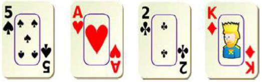

# Card 24 Game

This project is a Kotlin implementation of the Card 24 Game. The objective of the game is to manipulate four cards so that the end result is 24.

## Features

- Simple and intuitive gameplay
- Supports basic arithmetic operations: addition, subtraction, multiplication, and division

## Game Details

Card24 is an arithmetical card game in which the objective is to find a way to manipulate the numbers of four poker cards so that the end result is 24. Addition, subtraction, multiplication, or division, and sometimes other operations, may be used to make four numbers (from 1 to 13, where Ace, Jack, Queen, King represent 1, 11, 12, 13, respectively) equal 24. 

For example, for the four cards below, one of the possible solutions can be (13 5) * (1 + 2) = 24.

